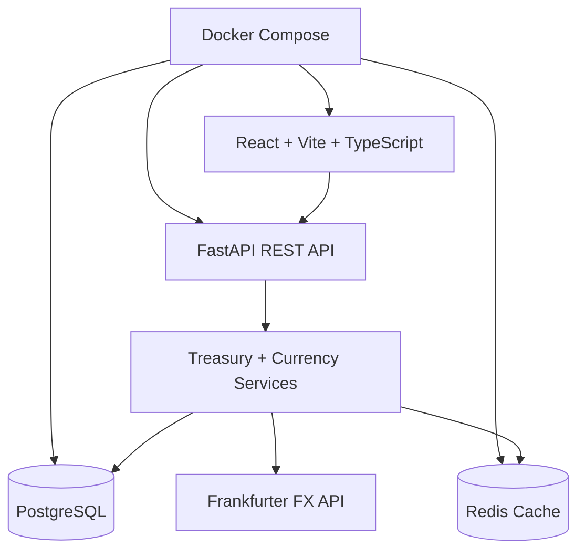

# TreasuryFX

TreasuryFX is a full-stack Treasury and FX Exposure Dashboard for finance teams that need to monitor foreign currency payables, receivables, maturity risk, and ZAR-equivalent financial impact.

The project keeps the original FastAPI, React, PostgreSQL, Redis, Docker Compose, currency conversion, and charting foundations, then extends them with a treasury exposure domain.

## Business Use Case

Treasury and finance teams can manually capture foreign currency exposures, review the latest ZAR conversion impact, identify high-risk maturities, and monitor currency concentration before settlement dates arrive.

Current demo scope:

- Manual exposure capture and maintenance
- Exposure conversion into ZAR using latest FX rates
- Risk scoring by value and due date
- Treasury summary metrics
- Exposure by currency analysis
- High-risk and upcoming maturity views
- Existing FX converter, rate trends, watchlist, and alerts retained as treasury tools

## Architecture



## Tech Stack

| Layer | Technologies |
| --- | --- |
| Backend | FastAPI, SQLAlchemy, Alembic, Pydantic, PostgreSQL, Redis |
| Frontend | React, TypeScript, Vite, Tailwind CSS, TanStack Query, Recharts |
| FX Data | Frankfurter API |
| DevOps | Docker, Docker Compose, Nginx |

## Quick Start

```bash
docker compose up --build
```

Open:

- Frontend: http://localhost:3000
- Backend API: http://localhost:8000
- API docs: http://localhost:8000/docs

The backend runs Alembic migrations automatically on container startup. The exposures migration includes realistic sample exposure data so the dashboard is useful immediately.

## Local Development

Backend:

```bash
cd backend
cp .env.example .env
python -m venv .venv
source .venv/bin/activate  # Windows: .venv\Scripts\activate
pip install -r requirements.txt
docker compose up postgres redis -d
alembic upgrade head
uvicorn app.main:app --reload --port 8000
```

Frontend:

```bash
cd frontend
cp .env.example .env
npm install
npm run dev
```

Open http://localhost:5173.

## Treasury API

Exposure CRUD:

- `GET /api/v1/exposures`
- `POST /api/v1/exposures`
- `GET /api/v1/exposures/{id}`
- `PUT /api/v1/exposures/{id}`
- `DELETE /api/v1/exposures/{id}`

Treasury dashboard:

- `GET /api/v1/treasury/summary`
- `GET /api/v1/treasury/exposure-by-currency`
- `GET /api/v1/treasury/high-risk-exposures`
- `GET /api/v1/treasury/upcoming-maturities`

Existing FX tools remain available:

- `GET /api/v1/rates/latest`
- `GET /api/v1/rates/convert`
- `GET /api/v1/rates/history`
- `GET /api/v1/currencies`
- `GET /api/v1/watchlist`
- `GET /api/v1/alerts`

## Risk Rules

Each open exposure is converted to ZAR and scored:

- `HIGH`: ZAR equivalent above 1,000,000 or due within 7 days
- `MEDIUM`: ZAR equivalent above 250,000 or due within 30 days
- `LOW`: all other open exposures

TreasuryFX also calculates total exposure, payable exposure, receivable exposure, net exposure, concentration by currency, and upcoming maturities.
